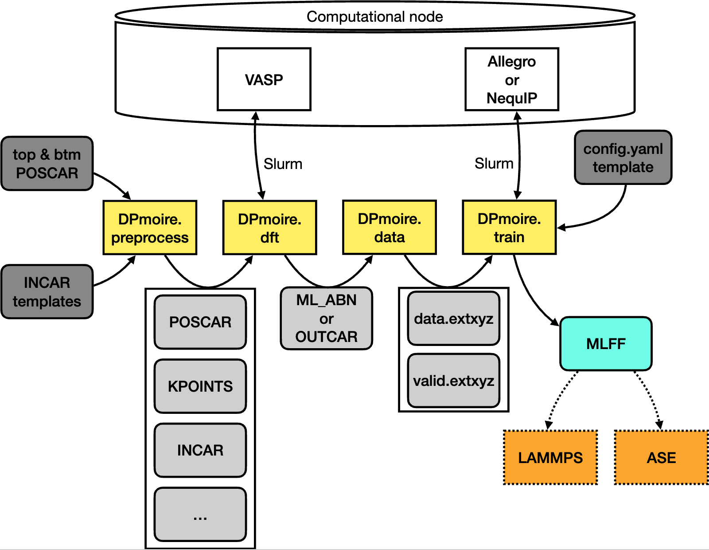

# DPmoire

DPmoire 是一款开源工具，专为构建摩尔体系精确的机器学习力场（MLFFs）而设计。



DPmoire 由四个功能模块构成。首先，当提供各层的单胞结构时，DPmoire.preprocess 模块会自动组合两层结构并生成 2 $\times$ 2 超胞的位移构型，同时会准备用于构建测试集的扭转结构。该预处理模块会根据提供的模板自动生成VASP输入文件。随后，DPmoire.dft 模块将通过 slurm 系统提交VASP计算任务。所有计算完成后，DPmoire.data 模块会从 ML_ABN 和 OUTCAR 文件中收集DFT计算数据，并生成训练集文件（data.extxyz）和测试集文件（valid.extxyz）。该格式可直接被 Allegro 和 NequIP 软件包读取。DPmoire.train 模块会根据给定模板修改配置文件中的系统相关参数，用于训练 Allegro 或 NequIP 的MLFF，并提交训练任务。训练完成后，获得的MLFF可在ASE或LAMMPS中用于结构弛豫计算。

## 目录

- [系统要求](#系统要求)
- [安装指南](#安装指南)
- [配置说明](#配置说明)
  - [示例设置](#示例设置)
  - [配置文件](#配置文件)
  - [目录结构与必需文件](#目录结构与必需文件)
- [运行DPmoire](#运行dpmoire)
  - [初始设置](#初始设置)
  - [构建数据集与训练](#构建数据集与训练)
  - [仅生成数据集](#仅生成数据集)
  - [基于现有数据集训练](#基于现有数据集训练)
  - [全新启动建议](#全新启动建议)
- [常见问题](#常见问题)
  - [训练集损失不下降](#训练集损失不下降)
    - [情况一](#情况一检查incar模板设置)
    - [情况二](#情况二检查md模拟温度)
- [扭转双层TMD材料的MLFF](#扭转双层tmd材料的mlff)
- [弛豫算例]()
- [扩展资源](#扩展资源)

## 系统要求

安装DPmoire前需确保系统已安装以下软件：

- [Slurm](https://slurm.schedmd.com/documentation.html)：用于任务提交管理的作业调度系统
- [VASP](https://www.vasp.at/)：第一性原理量子力学分子动力学模拟软件包
- [NequIP](https://github.com/mir-group/nequip)：具有高数据效率的E(3)-等变MLFF工具包
- [Allegro](https://github.com/mir-group/allegro)：针对大结构优化的E(3)-等变MLFF工具包

*注：若仅需使用DPmoire生成数据集，则无需安装`NequIP`或`Allegro`*

## 安装指南

安装`NequIP`后，通过源码安装DPmoire：

```bash
git clone https://github.com/JiaxuanLiu-Arsko/DPmoire.git
cd DPmoire
pip install .
```

## 配置说明

### 示例设置

[examples/MoS2](examples/MoS2/)目录提供了可直接运行的示例，包含完整的MoS₂模拟配置模板。

### 配置文件

DPmoire需通过`.yaml`格式的配置文件控制运行。[examples/MoS2/config.yaml](examples/MoS2/config.yaml)提供了带详细注释的示例配置。

关键参数说明：
  - **VASP_ML**：`True/False` 通常应设为True，可显著提升数据集质量
  - **do_relaxation**：`True/False` 是否在MD模拟前进行弛豫。首次运行时应当设为True
  - **init_mlff**：`True/False` 是否在MD前构建初始MLFF。当`input_dir`中无ML_AB和ML_FF文件时必须设为True
  - **symm_reduce**：`True/False` 根据晶体对称性减少位移矢量，可大幅降低计算成本
  - **auto_resub**：`True/False` 是否自动重新提交失败/取消的slurm任务
  - **twist_val**：`True/False` 生成扭转结构构建验证集
  - **max_val_n**：生成扭转结构的最大n值（n=1对应21.97°）
  - **min_val_n**：生成扭转结构的最小n值（建议≥3）
  - **n_sectors**：位移网格点数，生成n×n个位移构型（对称性约化前）
  - **sc**：计算所用超胞大小（sc=2表示使用2×2超胞）
  - **d**：初始层间距（影响VASP_MLFF截断半径及测试集质量）

常规情况下示例中的"计算设置"预设值即可适用（需调整"环境设置"适配本地系统）。追求更优性能时可尝试增大**n_sectors**值。

### 目录结构与必需文件

训练MLFF前需准备以下目录和文件：

- **目录结构：**
  - `input_dir`：存放VASP和NequIP训练的必要输入文件
  - `script_dir`：包含slurm环境下提交任务的bash脚本
  - `config.yaml`：DPmoire运行设置

- `input_dir`中的必需文件：
  - `init_INCAR`：初始VASP MLFF训练的INCAR模板
  - `rlx_INCAR`：MD前弛豫的INCAR模板
  - `MD_INCAR`：不同堆垛MD模拟的INCAR模板
  - `MD_monolayer_INCAR`：单层MD模拟的INCAR模板
  - `val_INCAR`：测试集计算的INCAR模板
  - `ML_AB`和`ML_FF`：初始VASP MLFF文件（仅当**init_mlff**为False时需要）
  - `vdw_kernel.bindat`：VASP范德华核函数文件（使用非局域vdW-DF泛函时必需）
  - `bot_layer.poscar`和`top_layer.poscar`：底层和顶层的单胞POSCAR文件（注意c轴长度需充足）

- `script_dir`中的必需文件：
  - `DFT_script.sh`：弛豫和MD使用的Slurm脚本
  - `val_script.sh`：构建转角结构测试集使用的Slurm脚本
  - `Learn_script.sh`：提交机器学习势训练任务所用的Slurm脚本

## 运行DPmoire

### 初始设置

**运行示例前需更新：**

1. **POTCAR目录：**
   - 修改配置文件中`POTCAR_dir`指向POTCAR文件所在目录

2. **Slurm脚本：**
   - 更新`scripts`目录中的脚本适配本地计算环境
   - 调整配置文件中`learn_script`和`DFT_script`路径

### 构建数据集与训练

进入示例目录执行训练命令：

```bash
cd ./example/MoS2
nohup DPmoireTrain ./config.yaml &
```

或等效命令：

```bash
nohup DPmoireTrain ./config.yaml --mode all &
```

该命令将在后台运行DPmoire，完成后训练的NequIP MLFF将保存在`work_dir/main/mlff.pth`。

### 仅生成数据集

仅运行DFT计算生成数据集：

```bash
nohup DPmoireTrain ./config.yaml --mode run &
```

生成的数据集将保存在`work_dir/`目录，合并后的完整数据集位于`./main/data/`，可转移至GPU机器单独训练：

```bash
cd ./main
nequip-train ./nequIP.yaml
```

### 基于现有数据集训练

在已完成VASP计算的目录中训练MLFF：

```bash
nohup DPmoireTrain ./config.yaml --mode train &
```

### 验证集配置

确保`nequip.yaml`中的`validation_dataset_file_name`和`n_val`与验证数据匹配。

## 全新启动建议

为新材料启动训练时需注意：

1. **POSCAR文件：**
   - 更新`top_layer.poscar`和`bot_layer.poscar`
   - 确保c轴长度充足

2. **INCAR文件：**
   - 更新所有`*_INCAR`模板中的范德华修正设置

3. **配置文件：**
   - 调整层间距参数`d`至合理值

DPmoire将自动处理：
- 设置ENCUT为`1.6 × ENMAX`
- 基于单层结构自动生成POTCAR
- 生成满足`n_k_i × a_i ≈ 40`的KPOINTS

## 重启任务提示

在旧目录重启任务时需注意：
1. 若修改了DFT参数，需同步更新配置文件中的`d`值
2. 若要从MD阶段重启，可将`init_mlff`和`do_relaxation`设为False
3. 手动重新提交计算后，需移除`work_dir`中的*.extxyz文件再以[train模式](#基于现有数据集训练)重启

## 常见问题

### 训练集损失不下降

当训练损失下降缓慢或$F_{rmse}$难以低于$1×10^{-2} eV/Å$时，通常源于训练集存在不兼容结构。

#### 情况一：检查INCAR模板设置

首先检查各INCAR模板中的VASP设置是否兼容。例如若弛豫使用IVDW=10而MD使用SCAN+RVV10，会导致数据不兼容。

#### 情况二：检查MD模拟温度

VASP MLFF模块有时会产生异常结构。虽然DPmoire预先构建初始MLFF可降低风险，但仍可能发生该问题。

通过检查MD温度可发现问题。正常情况最高温度可能略高于预设值（如预设330K但实际达到580K）。若某些轨迹温度超过1000K则存在问题。

可使用提供的Python脚本识别异常温度轨迹，手动重新提交问题目录的DFT计算后，[按前文说明](#重启任务提示)重新训练。

## 扭转双层TMD材料的MLFF

我们为AA和AB堆垛的扭转MX₂(M=Mo, W; X=S, Se, Te)体系训练了MLFF，训练结果可在[发布页面](https://github.com/JiaxuanLiu-Arsko/DPmoire/releases/tag/v1.0.0)获取。

## 弛豫算例

提供使用生成MLFF弛豫扭转结构的示例：
 - ASE弛豫示例见[此处](./example/relaxation_examples/ase_relaxation/tutorial.ipynb)
 - LAMMPS弛豫示例见[此处](./example/relaxation_examples/lammps_relaxation/tutorial.ipynb)

## 扩展资源

- [NequIP GitHub仓库](https://github.com/mir-group/nequip)
- [Allegro GitHub仓库](https://github.com/mir-group/allegro)
- [VASP文档](https://www.vasp.at/wiki/index.php/Main_Page)
- [Slurm文档](https://slurm.schedmd.com/documentation.html)